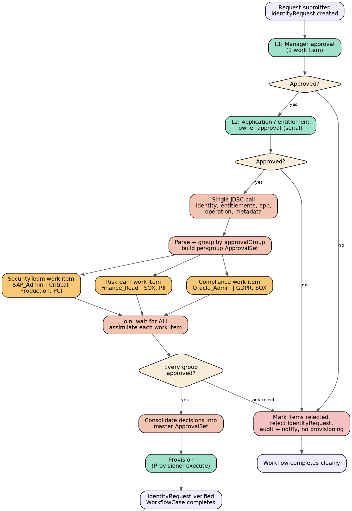

# 1. Executive summary

This design extends the standard LCM Provisioning workflow with a third, dynamic approval level. Levels 1 and 2 (manager, then application/entitlement owner) use the out-of-the-box approval scheme in serial mode — no code required. Level 3 is a new custom subprocess that makes a single JDBC call to an external risk system, groups the returned entitlement classifications by `approvalGroup`, generates one parallel approval work item per group (never per entitlement), waits for all of them, consolidates the decisions into one ApprovalSet, and returns control to the main workflow. Provisioning proceeds only if every group approves; any rejection stops provisioning and completes the workflow cleanly with the IdentityRequest marked rejected.

Guiding principles: never modify out-of-the-box (OOTB) workflows in place — clone them; put integration logic in a compiled Java helper, not sprawling BeanShell; reuse the OOTB approval machinery (Approval Library, Provisioning Approval Subprocess, Workflower assimilation) instead of re-implementing work item lifecycle handling; keep the WorkflowCase small by marking bulky intermediate variables transient.

# 2. Architecture


Components introduced or changed:

| Component | Type | Action |
|---|---|---|
| LCM Provisioning - Custom | Workflow (clone of LCM Provisioning) | Point LCM configuration at the clone. Sets `approvalScheme=manager,owner`, `approvalMode=serial`. |
| Approve and Provision Subprocess - Custom | Workflow (clone) | Insert the Classification Approval step between the L1/L2 approval step and the Provision step. |
| Classification Approval Subprocess | New custom workflow (type Subprocess) | JDBC call, grouping, dynamic parallel approvals, consolidation. |
| ClassificationServiceHelper | Custom Java class | Single JDBC call with retry/timeout, JSON parsing, grouping utilities. |
| Classification Service Settings | Custom object | JDBC URL, credentials (encrypted), timeout, retry counts, SQL. |
| Workgroups (RiskTeam, SecurityTeam, …) | Identity workgroups | Approval targets. Must exist or be provisioned by governance process. |

Not modified: `Identity Request Initialize` (it only creates the IdentityRequest and pre-approval processing — our change is downstream), `Provisioning Approval Subprocess` (reused as-is for L1/L2, and optionally re-invoked for L3 with pre-built approvals), Approval Library, LCM libraries.

# 3. Approval flow



## 3.1 Sequence diagram (Mermaid source — paste into a Confluence Mermaid macro)

```
sequenceDiagram
    autonumber
    participant UI as Access Request UI
    participant WF as LCM Provisioning - Custom
    participant PAS as Provisioning Approval Subprocess
    participant CAS as Classification Approval Subprocess
    participant J as ClassificationServiceHelper (JDBC)
    participant EXT as External risk system
    participant WI as WorkItems
    participant PE as Provisioning engine

    UI->>WF: Submit request (ProvisioningPlan)
    WF->>WF: Identity Request Initialize (IdentityRequest created)
    WF->>PAS: approvalScheme=manager,owner mode=serial
    PAS->>WI: Open manager work item (L1)
    WI-->>PAS: Manager approves (assimilated)
    PAS->>WI: Open owner work item(s) (L2, serial)
    WI-->>PAS: Owner approves (assimilated)
    PAS-->>WF: approvalSet (L1+L2 decisions)
    WF->>CAS: plan, project, identityRequestId
    CAS->>J: fetchClassifications(payload) — ONCE
    J->>EXT: 1 JDBC call
    EXT-->>J: [{entitlement, classifications[], approvalGroup}...]
    J-->>CAS: List<Map> records
    CAS->>CAS: Group by approvalGroup, build per-group ApprovalSet + Workflow.Approval list
    par SecurityTeam
        CAS->>WI: Work item (SAP_Admin | Critical, Production, PCI)
    and RiskTeam
        CAS->>WI: Work item (Finance_Read | SOX, PII)
    and Compliance
        CAS->>WI: Work item (Oracle_Admin | GDPR, SOX)
    end
    WI-->>CAS: Each completion assimilated; case advances only when ALL complete
    CAS->>CAS: Consolidate into master ApprovalSet, compute approved flag
    CAS-->>WF: approvalSet, approved
    alt approved == true
        WF->>PE: Provisioner.compile/execute (ProvisioningProject)
        PE-->>WF: results; IdentityRequest → Verifying → Completed
    else any group rejected
        WF->>WF: Reject IdentityRequest, audit, notify, end cleanly
    end
```

## 3.2 Step-by-step execution timeline

| T | Actor | Action | Persistence effect |
|---|---|---|---|
| T0 | User | Submits access request | `spt_identity_request` + items created (Identity Request Initialize) |
| T1 | Workflower | LCM Provisioning - Custom launched | `spt_workflow_case` + paired `spt_task_result` created |
| T2 | Workflower | L1 manager Approval reached; work item opened; case suspends | `spt_work_item` row (manager); case XML updated |
| T3 | Manager | Approves | Work item deleted/archived; decision assimilated; case advances |
| T4 | Workflower | L2 owner approval (serial) — repeat of T2–T3 per owner | Work item per owner, sequentially |
| T5 | Step script | Single JDBC call to external system | No IIQ writes; guarded by `classificationFetchDone` flag |
| T6 | Step script | Parse, group by approvalGroup, build per-group ApprovalSets and Workflow.Approval list | Variables persisted into case XML |
| T7 | Workflower | Parallel approval: N work items opened simultaneously; case suspends | N `spt_work_item` rows, one per group |
| T8 | Approvers | Each group acts independently, any order | Each completion assimilates decisions; case advances only after the last one |
| T9 | Step script | Consolidate decisions into master ApprovalSet; `approved` computed | IdentityRequest items updated (approval states) |
| T10a | Provisioner | All approved → compile/execute project; connectors provision | `spt_provisioning_transaction` rows; request → Verifying |
| T10b | Workflow | Any rejection → mark items rejected, reject IdentityRequest, audit, notify | Request completion status = Failure/Rejected; no provisioning |
| T11 | Workflower | Case completes; TaskResult finalized; case object removed | `spt_workflow_case` row deleted; `spt_task_result` retained |

# 4. Answers to the design questions

## Q1. Which workflows should be modified?

Clone, never edit OOTB in place (patches/upgrades overwrite OOTB objects):

- **LCM Provisioning** → clone to `LCM Provisioning - Custom`; register it in the LCM business-process configuration so access requests launch it. Often the only change here is configuration (`approvalScheme`, `approvalMode`) plus pointing at the cloned subprocess.
- **Approve and Provision Subprocess** → clone; this is where the new `Classification Approvals` step is inserted between the existing approval step and the provision step, because it already owns the approved/rejected branching and the provisioning handoff.
- **Provisioning Approval Subprocess** → *not modified*. Used as-is for L1/L2. For L3 you may re-invoke it passing pre-built approvals (see Q3/Q5), which reuses its assimilation, IdentityRequest refresh, escalation and e-signature plumbing.
- **Identity Request Initialize** → not modified; it runs before approvals (request creation, policy checks, attribute expansion).
- **Libraries** → no OOTB library changes. Add one custom Java helper class (and optionally a custom workflow library if you prefer `call:` syntax over `script:`).

## Q2 / Q3. Where should the JDBC call occur, and in what construct?

**In a dedicated workflow Step of the custom subprocess, implemented as a thin BeanShell script that delegates immediately to a compiled Java helper class.** Reasoning:

- **Not in an approval assignment/owner rule**: owner rules execute during approval expansion — potentially once per approval object, on UI threads, and are re-evaluated in ways you don't control. You cannot guarantee "call JDBC exactly once" there, and a slow external call inside owner resolution blocks work item creation.
- **Not inline in the Approval element**: same re-entrancy problem, plus no clean retry/error branch.
- **A workflow Step gives you**: exactly-once semantics (guard with a case variable), an error transition, the ability to mark the step `background=true` so the external call runs on a request-processor thread instead of the interactive thread, and clean logging boundaries.
- **Java class, not 300 lines of BeanShell**: compiled code is testable, debuggable, performant (BeanShell is interpreted reflection), and keeps connection/retry/JSON logic out of workflow XML. BeanShell should only marshal workflow variables in and out.
- Run it **after** L2 approval completes (don't burden the external system for requests that die at L1/L2) and **before** any L3 approval objects are built.

## Q4. How should the ApprovalSet be updated?

Maintain two levels:

1. **Per-group ApprovalSets** — built at grouping time, one per approvalGroup, containing only that group's ApprovalItems. Each is attached to its own `Workflow.Approval` (`approval.setApprovalSet(groupSet)`), so each work item displays only its group's entitlements.
2. **Master ApprovalSet** — the subprocess's `approvalSet` in/out variable. After the join, iterate every group approval's set and copy each item's state, approver, and comments onto the matching master item (match on application + name + value). Then update the IdentityRequest items (OOTB `Update Identity Request` pattern / IdentityRequestLibrary) so the request UI reflects per-item decisions. `approved = true` only if every item in every group set is approved.

Never mutate an ApprovalSet from multiple work items concurrently — that is why each parallel work item must carry its *own* set, with consolidation happening single-threaded in the workflow step after the join.

## Q5. How should ApprovalItems be generated?

One `ApprovalItem` per (entitlement returned by the external system), placed into its group's set:

- `application` = application name from the plan/record
- `name` = entitlement attribute (e.g., `groups`, `roles`)
- `value` = entitlement value (e.g., `SAP_Admin`)
- `operation` = plan operation (`Add`/`Remove`)
- custom attributes: `classifications` (List), `approvalGroup`, `requester`, `targetIdentity` — the work item renderer reads these for display.

The *work item* granularity is the approval group; the *ApprovalItem* granularity stays the entitlement so per-entitlement decisions, auditing, and IdentityRequest item mapping still work.

## Q6. How should work items be generated?

Never create WorkItems by hand (`new WorkItem()` + save loses assimilation wiring). Build `Workflow.Approval` objects and let **Workflower** open the work items: for each group, create an Approval with `owner` = workgroup name, `mode` inherited parent `parallel`, its own ApprovalSet, description, and work-item configuration (renderer `lcmWorkItemRenderer.xhtml`, escalation, reminders via WorkItemConfig). Workflower creates one `spt_work_item` row per leaf approval, links it to the WorkflowCase, and handles notification, forwarding, escalation, and assimilation automatically.

## Q7. How does the subprocess return to the main workflow?

A subprocess is invoked by a Step whose action is `call:workflow` — i.e., a Step in `Approve and Provision Subprocess - Custom` with `<Arg name="workflow" value="Classification Approval Subprocess"/>` (or the `<WorkflowRef>` form). Workflower runs the child case *inline within the same WorkflowCase* (subprocesses share the case; they are not separate cases). Variables declared `output="true"` in the subprocess (`approvalSet`, `approved`) are copied back into the caller's variables via the step's `Return` elements. The caller's next `Transition` then branches on `approved`.

## Q8. "ApprovalSplitPoint" and the Approval Library internals

A precision note first: **there is no class named `ApprovalSplitPoint` in IdentityIQ.** The term people use covers two real mechanisms:

1. **Approval splitting inside Workflower.** A `<Approval>` element is a tree (`Workflow.Approval` with children). When Workflower reaches an approval step it *expands* the tree: an approval whose `owner` resolves to multiple identities, or which has explicit children, is split into leaf approvals. The parent's `mode` governs scheduling: `serial` (one at a time, in order), `serialPoll` (serial, non-blocking consultation), `parallel` (all leaf work items opened at once, wait for all), `parallelPoll` (all at once, decisions advisory), `any` (all at once, first completion wins and cancels siblings). Each leaf approval gets a WorkItem; the parent completes according to its mode. That expansion point — where one logical approval becomes N work items — is the "split point."
2. **The Approval Library** (`libraries="Approval"` → `sailpoint.workflow.ApprovalLibrary`, used with the Identity/LCM libraries). Its key service, used by Provisioning Approval Subprocess, is building common approvals from a scheme: for each token in `approvalScheme` (`manager`, `owner`, `securityOfficer`, `identityRequest`, custom), an approval generator (IdentityApprovalGenerator pattern) resolves the approver population, builds one `Workflow.Approval` per approver with an appropriately filtered ApprovalSet, wires the standard renderer/escalation config, and returns the list which the subprocess then executes. Our L3 design mimics exactly this contract — we build the same `List<Workflow.Approval>` shape, just sourced from JDBC data instead of a scheme — which is why the OOTB execution/assimilation machinery can run our approvals unchanged.

## Q9. How are parallel approvals synchronized?

There is no thread-level parallelism — the WorkflowCase is single-threaded and event-driven. "Parallel" means all leaf work items are *open simultaneously* while the case is suspended. Synchronization works like this: when any work item completes, Workflower assimilates it (copies the work item's returned variables/ApprovalSet into the corresponding Approval node, marks that node complete) and then evaluates the parent approval's completion condition. For `mode=parallel`, the parent is complete only when *every* child is complete. If children remain open, the case simply re-suspends. Only when the last child assimilates does the approval step complete and the case `advance()` to the next step. The join is therefore implicit in the parent approval's mode — you do not build a joining step yourself.

## Q10. How does ApprovalSet consolidation occur?

Three layers:

1. **Per work item**: the approver's per-item decisions are stored in the work item's ApprovalSet copy; on completion Workflower assimilates that copy back onto the owning `Workflow.Approval` (interceptor hook `postAssimilation` fires here if you need custom logic).
2. **Per approval step**: after the parent approval completes, an `AfterScript` (or the OOTB subprocess's assimilation steps) walks all leaf approvals and merges their sets into the master `approvalSet` variable, matching items by application+name+value and copying state/approver/comments.
3. **IdentityRequest**: `Update Identity Request` steps (IdentityRequestLibrary) push per-item approval states onto `spt_identity_request_item` rows so the request UI and audit reflect the outcome.

## Q11. How does work item completion trigger workflow continuation?

When an approver clicks Approve/Reject, the UI (WorkItemBean) hands the completed WorkItem to `sailpoint.api.Workflower`. Workflower loads the owning WorkflowCase (FK on the work item), assimilates the work item (Q10 layer 1), deletes/archives the work item, and calls the case's advance logic: re-evaluate the current step's completion, follow transitions, execute subsequent steps synchronously until the case either completes or suspends again on the next wait state (another open work item, background step, or wait). This all happens in the approver's session thread (or via the Perform Maintenance / request processor for escalations and timeouts). If the case can't advance (other parallel items still open), assimilation is all that happens — which is exactly the parallel join behavior of Q9.

# 5. Workflow XML

## 5.1 LCM Provisioning - Custom (top level — changes only)

```xml
<!-- Clone of "LCM Provisioning". Only material deltas shown. -->
<Workflow name="LCM Provisioning - Custom" type="LCMProvisioning"
          libraries="Identity,Approval,PolicyViolation,LCM,IdentityRequest">

  <!-- L1 + L2 sequential: manager first, then application/entitlement owner -->
  <Variable name="approvalScheme" initializer="manager,owner"/>
  <Variable name="approvalMode"   initializer="serial"/>

  <!-- point at the customized approve-and-provision subprocess -->
  <Step name="Approve and Provision">
    <Arg name="workflow" value="Approve and Provision Subprocess - Custom"/>
    <!-- all other Args identical to OOTB -->
  </Step>
</Workflow>
```

## 5.2 Approve and Provision Subprocess - Custom (inserted step)

```xml
<!-- Clone of "Approve and Provision Subprocess". Insert between the OOTB
     "Do Provisioning Approvals" (L1/L2) step and the "Provision" step. -->

<Step name="Classification Approvals" >
  <Arg name="workflow" value="Classification Approval Subprocess"/>
  <Arg name="plan" value="ref:plan"/>
  <Arg name="project" value="ref:project"/>
  <Arg name="identityName" value="ref:identityName"/>
  <Arg name="identityDisplayName" value="ref:identityDisplayName"/>
  <Arg name="identityRequestId" value="ref:identityRequestId"/>
  <Arg name="launcher" value="ref:launcher"/>
  <Arg name="approvalSet" value="ref:approvalSet"/>
  <Return name="approvalSet" to="approvalSet"/>
  <Return name="approved"    to="classificationApproved"/>
</Step>

<!-- rewire transitions -->
<!-- old: Do Provisioning Approvals -> Provision (when approved)          -->
<!-- new: Do Provisioning Approvals -> Classification Approvals (approved) -->
<Transition to="Classification Approvals"
            when="script:(approved != null &amp;&amp; approved.booleanValue())"/>
<Transition to="Reject Request"/>

<!-- from Classification Approvals: -->
<Transition to="Provision"
            when="script:(classificationApproved != null
                          &amp;&amp; classificationApproved.booleanValue())"/>
<Transition to="Reject Request"/>

<Step name="Reject Request">
  <Script><Source>
    import sailpoint.object.*;
    // mark every remaining item rejected so nothing provisions
    if (approvalSet != null) {
      for (ApprovalItem it : approvalSet.getItems())
        if (!it.isRejected() &amp;&amp; !it.isApproved()) it.reject();
    }
    // OOTB steps then: audit, notify requester, refresh IdentityRequest
    // (completion status Rejected/Failure), and transition to End.
  </Source></Script>
  <Transition to="Refresh Identity Request"/>
</Step>
```

## 5.3 Classification Approval Subprocess (new, complete)

```xml
<?xml version='1.0' encoding='UTF-8'?>
<!DOCTYPE Workflow PUBLIC "sailpoint.dtd" "sailpoint.dtd">
<Workflow name="Classification Approval Subprocess"
          libraries="Identity,Approval,LCM,IdentityRequest" type="Subprocess">

  <!-- ============ inputs ============ -->
  <Variable name="plan"                input="true" required="true"/>
  <Variable name="project"             input="true"/>
  <Variable name="identityName"        input="true" required="true"/>
  <Variable name="identityDisplayName" input="true"/>
  <Variable name="identityRequestId"   input="true"/>
  <Variable name="launcher"            input="true"/>

  <!-- ============ in/out ============ -->
  <Variable name="approvalSet" input="true" output="true"/>

  <!-- ============ outputs ============ -->
  <Variable name="approved" output="true">
    <Description>true only if every approval group approved every item</Description>
  </Variable>

  <!-- ============ internal state ============ -->
  <!-- transient: large, recomputable, only needed before first suspension -->
  <Variable name="classificationRecords" transient="true"/>
  <!-- persisted: must survive suspension while approvers act -->
  <Variable name="classificationFetchDone" initializer="false"/>
  <Variable name="classificationApprovals"/>
  <Variable name="classificationApprovalSet"/>

  <Step icon="Start" name="Start" posX="20" posY="20">
    <Transition to="Fetch Classifications"/>
  </Step>

  <!-- background=true: runs on a request-processor thread so the
       interactive user thread is not blocked by the external call -->
  <Step name="Fetch Classifications" resultVariable="classificationRecords"
        background="true">
    <Script><Source><![CDATA[
      // thin marshalling only - logic lives in the Java helper (section 7)
      import com.acme.iiq.classification.ClassificationServiceHelper;
      if (classificationFetchDone != null && classificationFetchDone.booleanValue()) {
          // idempotency guard: never call JDBC twice for one case
          return workflow.get("classificationRecords");
      }
      Object records = ClassificationServiceHelper.fetchClassifications(
          context, plan, identityName, identityRequestId, launcher);
      workflow.put("classificationFetchDone", Boolean.TRUE);
      return records;
    ]]></Source></Script>
    <Transition to="Build Group Approvals"
                when="script:classificationRecords != null
                      &amp;&amp; !classificationRecords.isEmpty()"/>
    <!-- nothing returned => no L3 approvals required -->
    <Transition to="No Classification Approvals Needed"/>
  </Step>

  <Step name="No Classification Approvals Needed">
    <Script><Source>workflow.put("approved", Boolean.TRUE);</Source></Script>
    <Transition to="End"/>
  </Step>

  <Step name="Build Group Approvals">
    <Script><Source><![CDATA[
      // BeanShell in section 6.2: groups records by approvalGroup,
      // builds one ApprovalSet per group + one Workflow.Approval per group,
      // stores lists in classificationApprovals / classificationApprovalSet
    ]]></Source></Script>
    <Transition to="Parallel Group Approvals"/>
  </Step>

  <!-- Reuse the OOTB approval executor with PRE-BUILT approvals.
       Passing "approvals" bypasses scheme-based building; approvalMode=parallel
       opens every group work item at once and joins on all of them. -->
  <Step name="Parallel Group Approvals">
    <Arg name="workflow" value="Provisioning Approval Subprocess"/>
    <Arg name="approvals"     value="ref:classificationApprovals"/>
    <Arg name="approvalMode"  value="parallel"/>
    <Arg name="approvalSet"   value="ref:classificationApprovalSet"/>
    <Arg name="plan"          value="ref:plan"/>
    <Arg name="project"       value="ref:project"/>
    <Arg name="identityName"  value="ref:identityName"/>
    <Arg name="identityDisplayName" value="ref:identityDisplayName"/>
    <Arg name="identityRequestId"   value="ref:identityRequestId"/>
    <Arg name="launcher"      value="ref:launcher"/>
    <Return name="approvalSet" to="classificationApprovalSet"/>
    <Transition to="Consolidate Decisions"/>
  </Step>

  <Step name="Consolidate Decisions">
    <Script><Source><![CDATA[
      // BeanShell in section 6.3: merge per-group decisions into the
      // master approvalSet, compute "approved"
    ]]></Source></Script>
    <Transition to="End"/>
  </Step>

  <Step icon="Stop" name="End"/>
</Workflow>
```

**Version check (do this first in a sandbox):** in your 8.4 installation open `Provisioning Approval Subprocess` and confirm it declares an `approvals` input variable (list of pre-built `Workflow.Approval`) that short-circuits scheme building — this is the documented extension point this design leans on. If your build lacks it, fall back plan: give the `Parallel Group Approvals` step its own inline `<Approval mode="parallel">` whose children are attached in a `startApproval` InterceptorScript from `classificationApprovals`. Everything else in this document is unchanged.

# 6. BeanShell

## 6.1 JDBC payload assembly (inside the Java helper call — shown for clarity)

```java
// Extracting requested entitlements from the plan (used by the helper)
import sailpoint.object.ProvisioningPlan;
import sailpoint.object.ProvisioningPlan.AccountRequest;
import sailpoint.object.ProvisioningPlan.AttributeRequest;

List entRecords = new ArrayList();   // one map per requested entitlement
if (plan != null && plan.getAccountRequests() != null) {
    for (AccountRequest ar : plan.getAccountRequests()) {
        if (ar.getAttributeRequests() == null) continue;
        for (AttributeRequest attr : ar.getAttributeRequests()) {
            Map m = new HashMap();
            m.put("application", ar.getApplication());
            m.put("nativeIdentity", ar.getNativeIdentity());
            m.put("attribute", attr.getName());
            m.put("value", attr.getValue());     // may be List for multi-valued
            m.put("operation", attr.getOperation() != null
                               ? attr.getOperation().toString() : "Add");
            entRecords.add(m);
        }
    }
}
```

## 6.2 Grouping and building per-group approvals

```java
import sailpoint.object.*;
import sailpoint.object.Workflow.Approval;

List records = (List) workflow.get("classificationRecords");
// records: List<Map> with keys entitlement, classifications(List), approvalGroup,
//          plus application/attribute/operation echoed back by the helper

// ---- 3. group by approvalGroup (dedupes groups automatically) ----
Map grouped = new LinkedHashMap();          // group -> List<Map>
for (Object o : records) {
    Map rec = (Map) o;
    String grp = (String) rec.get("approvalGroup");
    if (grp == null || grp.trim().length() == 0) grp = "DefaultRiskApprovers";
    List bucket = (List) grouped.get(grp);
    if (bucket == null) { bucket = new ArrayList(); grouped.put(grp, bucket); }
    bucket.add(rec);
}

// ---- 4./5. one Approval per group, one ApprovalItem per entitlement ----
List approvals = new ArrayList();           // List<Workflow.Approval>
ApprovalSet l3Master = new ApprovalSet();   // union of all group items

for (Object e : grouped.entrySet()) {
    Map.Entry entry = (Map.Entry) e;
    String group = (String) entry.getKey();
    List bucket  = (List) entry.getValue();

    ApprovalSet groupSet = new ApprovalSet();
    Set allClassifications = new LinkedHashSet();
    Set allEnts = new LinkedHashSet();

    for (Object o : bucket) {
        Map rec = (Map) o;
        ApprovalItem item = new ApprovalItem();
        item.setApplication((String) rec.get("application"));
        item.setName((String) rec.get("attribute"));
        item.setValue(rec.get("entitlement"));
        item.setOperation((String) rec.get("operation"));
        item.setAttribute("classifications", rec.get("classifications"));
        item.setAttribute("approvalGroup", group);
        item.setAttribute("requester", launcher);
        item.setAttribute("targetIdentity", identityDisplayName);
        groupSet.add(item);
        l3Master.add(item);                 // same object: single source of truth
        allEnts.add(rec.get("entitlement"));
        if (rec.get("classifications") != null)
            allClassifications.addAll((List) rec.get("classifications"));
    }

    Approval appr = new Approval();
    appr.setOwner(group);                   // workgroup name
    appr.setApprovalSet(groupSet);          // work item shows ONLY this group's items
    appr.setDescription("Classification approval [" + group + "] for "
        + identityDisplayName + " - entitlements: " + allEnts
        + " - classifications: " + allClassifications);
    appr.setSend("approvalSet");            // push set into the work item
    appr.setReturn("approvalSet");          // pull decisions back on completion
    appr.setRenderer("lcmWorkItemRenderer.xhtml");
    approvals.add(appr);
}

workflow.put("classificationApprovals", approvals);
workflow.put("classificationApprovalSet", l3Master);
```

## 6.3 Consolidation after the join

```java
import sailpoint.object.*;

ApprovalSet l3Set = (ApprovalSet) workflow.get("classificationApprovalSet");
ApprovalSet master = (ApprovalSet) workflow.get("approvalSet");
boolean allApproved = true;

if (l3Set != null && l3Set.getItems() != null) {
    for (ApprovalItem it : l3Set.getItems()) {
        if (!it.isApproved()) allApproved = false;

        // 8. consolidate: reflect L3 decision onto the master (L1/L2) set
        if (master != null && master.getItems() != null) {
            for (ApprovalItem m : master.getItems()) {
                boolean same =
                    sailpoint.tools.Util.nullSafeEq(m.getApplication(), it.getApplication(), true) &&
                    sailpoint.tools.Util.nullSafeEq(m.getName(),        it.getName(),        true) &&
                    sailpoint.tools.Util.nullSafeEq(m.getValue(),       it.getValue(),       true);
                if (same) {
                    m.setState(it.getState());
                    m.setApprover(it.getApprover());
                    if (it.getComments() != null)
                        for (Object c : it.getComments()) m.addComment((Comment) c);
                }
            }
        }
    }
} 
workflow.put("approved", Boolean.valueOf(allApproved));
workflow.put("approvalSet", master != null ? master : l3Set);

log.info("Classification approvals consolidated for request "
    + workflow.get("identityRequestId") + " approved=" + allApproved);
```

# 7. Java helper class

Compile into `WEB-INF/classes` (or a jar in `WEB-INF/lib`) on every node; restart required.

```java
package com.acme.iiq.classification;

import java.sql.*;
import java.util.*;
import sailpoint.api.SailPointContext;
import sailpoint.object.Custom;
import sailpoint.object.ProvisioningPlan;
import sailpoint.object.ProvisioningPlan.AccountRequest;
import sailpoint.object.ProvisioningPlan.AttributeRequest;
import sailpoint.tools.GeneralException;
import sailpoint.tools.JsonHelper;
import sailpoint.tools.Util;
import org.apache.logging.log4j.LogManager;
import org.apache.logging.log4j.Logger;

/**
 * Single-call JDBC client for the external classification/risk service.
 * Configuration lives in the Custom object "Classification Service Settings":
 *   jdbcUrl, jdbcUser, jdbcPassword (encrypted), jdbcDriver,
 *   queryTimeoutSecs, maxRetries, retryBackoffMillis, sql
 */
public final class ClassificationServiceHelper {

    private static final Logger log =
        LogManager.getLogger("com.acme.iiq.classification");

    private ClassificationServiceHelper() {}

    /** Entry point used by the workflow step. Returns List<Map> with keys:
     *  application, attribute, operation, entitlement,
     *  classifications (List<String>), approvalGroup. */
    public static List<Map<String,Object>> fetchClassifications(
            SailPointContext ctx, ProvisioningPlan plan, String identityName,
            String identityRequestId, String launcher) throws GeneralException {

        Custom cfg = ctx.getObjectByName(Custom.class,
                                         "Classification Service Settings");
        if (cfg == null)
            throw new GeneralException("Missing Custom: Classification Service Settings");

        List<Map<String,Object>> requested = extractEntitlements(plan);
        if (requested.isEmpty()) return Collections.emptyList();

        String payloadJson = JsonHelper.toJson(buildPayload(
                identityName, identityRequestId, launcher, requested));

        int maxRetries = Util.atoi(Util.otos(cfg.get("maxRetries")));
        long backoff   = Math.max(500L, Util.atoi(Util.otos(cfg.get("retryBackoffMillis"))));
        GeneralException last = null;

        for (int attempt = 0; attempt <= maxRetries; attempt++) {
            try {
                long t0 = System.currentTimeMillis();
                List<Map<String,Object>> out =
                        callOnce(ctx, cfg, payloadJson, requested);
                log.info("classification fetch ok request={} attempt={} rows={} ms={}",
                         identityRequestId, attempt, out.size(),
                         System.currentTimeMillis() - t0);
                return out;
            } catch (GeneralException ge) {
                last = ge;
                log.warn("classification fetch failed request={} attempt={} err={}",
                         identityRequestId, attempt, ge.getMessage());
                if (attempt < maxRetries)
                    try { Thread.sleep(backoff * (1L << attempt)); } // exp. backoff
                    catch (InterruptedException ie) {
                        Thread.currentThread().interrupt();
                        throw new GeneralException("Interrupted during retry", ie);
                    }
            }
        }
        throw last;   // step error-transition / workflow error handling takes over
    }

    private static List<Map<String,Object>> callOnce(
            SailPointContext ctx, Custom cfg, String payloadJson,
            List<Map<String,Object>> requested) throws GeneralException {

        String url    = Util.otos(cfg.get("jdbcUrl"));
        String user   = Util.otos(cfg.get("jdbcUser"));
        String pass   = ctx.decrypt(Util.otos(cfg.get("jdbcPassword")));
        String driver = Util.otos(cfg.get("jdbcDriver"));
        String sql    = Util.otos(cfg.get("sql"));   // e.g. "{call GET_CLASSIFICATIONS(?)}"
        int timeout   = Math.max(5, Util.atoi(Util.otos(cfg.get("queryTimeoutSecs"))));

        try { Class.forName(driver); }
        catch (ClassNotFoundException e) {
            throw new GeneralException("JDBC driver not found: " + driver, e); }

        try (Connection con = DriverManager.getConnection(url, user, pass);
             CallableStatement st = con.prepareCall(sql)) {

            st.setQueryTimeout(timeout);
            st.setString(1, payloadJson);
            boolean hasRs = st.execute();
            String json = null;
            if (hasRs) {
                try (ResultSet rs = st.getResultSet()) {
                    if (rs.next()) json = rs.getString(1);
                }
            }
            return parseResponse(json, requested);

        } catch (SQLException e) {
            throw new GeneralException("Classification JDBC call failed: "
                                       + e.getMessage(), e);
        }
    }

    /** Parse [{entitlement, classifications[], approvalGroup}...] and join it
     *  back to the requested items so application/attribute/operation ride along. */
    @SuppressWarnings("unchecked")
    static List<Map<String,Object>> parseResponse(
            String json, List<Map<String,Object>> requested) throws GeneralException {

        if (Util.isNullOrEmpty(json)) return Collections.emptyList();
        List<Map<String,Object>> raw =
            (List<Map<String,Object>>)(List<?>) JsonHelper.listFromJson(Map.class, json);

        Map<String, Map<String,Object>> byValue = new HashMap<>();
        for (Map<String,Object> req : requested) {
            Object v = req.get("value");
            if (v instanceof Collection)
                for (Object each : (Collection<?>) v)
                    byValue.put(Util.otos(each), req);
            else byValue.put(Util.otos(v), req);
        }

        List<Map<String,Object>> out = new ArrayList<>();
        for (Map<String,Object> rec : raw) {
            String ent = Util.otos(rec.get("entitlement"));
            Map<String,Object> req = byValue.get(ent);
            Map<String,Object> row = new HashMap<>();
            row.put("entitlement", ent);
            row.put("classifications", rec.get("classifications"));
            row.put("approvalGroup", Util.otos(rec.get("approvalGroup")));
            row.put("application", req != null ? req.get("application") : null);
            row.put("attribute",   req != null ? req.get("attribute")   : null);
            row.put("operation",   req != null ? req.get("operation")   : "Add");
            out.add(row);
        }
        return out;
    }

    private static Map<String,Object> buildPayload(String identityName,
            String requestId, String launcher, List<Map<String,Object>> requested) {
        Map<String,Object> p = new LinkedHashMap<>();
        p.put("identity", identityName);
        p.put("identityRequestId", requestId);
        p.put("requester", launcher);
        p.put("items", requested);            // application, entitlement, operation
        p.put("source", "IdentityIQ-8.4");
        return p;
    }

    private static List<Map<String,Object>> extractEntitlements(ProvisioningPlan plan) {
        List<Map<String,Object>> out = new ArrayList<>();
        if (plan == null || plan.getAccountRequests() == null) return out;
        for (AccountRequest ar : plan.getAccountRequests()) {
            if (ar.getAttributeRequests() == null) continue;
            for (AttributeRequest attr : ar.getAttributeRequests()) {
                Map<String,Object> m = new LinkedHashMap<>();
                m.put("application", ar.getApplication());
                m.put("nativeIdentity", ar.getNativeIdentity());
                m.put("attribute", attr.getName());
                m.put("value", attr.getValue());
                m.put("operation", attr.getOperation() != null
                                   ? attr.getOperation().toString() : "Add");
                out.add(m);
            }
        }
        return out;
    }
}
```

# 8. Q15–Q20: state, recovery, internals, data model, performance

## Q15. Transient vs persisted variables

The entire WorkflowCase (all non-transient variables, serialized as XML) is written to `spt_workflow_case.attributes` at every suspension. Rules:

| Variable | Setting | Why |
|---|---|---|
| `classificationRecords` (raw JDBC/JSON result) | `transient="true"` | Large, recomputable, consumed before the first L3 suspension. Transient variables are dropped when the case suspends — never rely on them across a work item wait. |
| `classificationFetchDone` | persisted | Idempotency guard must survive restarts. |
| `classificationApprovals`, `classificationApprovalSet` | persisted | Needed while the case is suspended waiting for approvers (hours/days). |
| `approvalSet`, `approved`, `plan`, `project` | persisted (OOTB) | Core LCM state. |
| Anything bulky and re-derivable (lookup caches, formatted strings) | transient | Keeps the case XML CLOB small — the case is re-serialized on *every* suspension, so CLOB size directly costs every approval action. |

Important consequence: because `classificationRecords` is transient, the fetch step and the build step must complete **before** any approval opens (they do, in this design) — never read a transient variable after a wait state.

## Q16. Recovery if the server restarts while waiting for approvals

Nothing special is needed — this is the core reason to keep state in persisted case variables. While waiting, the case is *not running*: it exists only as the `spt_workflow_case` row plus open `spt_work_item` rows. A JVM restart loses nothing. When an approver later completes a work item, Workflower reloads the case from the database and resumes (Q17). What you must design for:

- Steps already executed never re-run — execution position is part of the persisted case.
- The one risky window is a crash *mid-step* (e.g., during the JDBC call in a background step): the request-processor Request will be retried, so the step may run twice — hence the `classificationFetchDone` guard and a read-only external call (idempotent by design).
- Do not cache SailPointContext or live JDBC objects in workflow variables; they are not serializable and will corrupt resume.

## Q17. How Workflower resumes after the last work item completes

Completion of the final parallel work item → `Workflower.process(workItem)` → load owning WorkflowCase → assimilate the item's ApprovalSet/variables into its Approval node → evaluate parent approval: all children now complete → mark approval step complete → `advance()` the case: execute `Consolidate Decisions` synchronously, follow transitions, pop back from the subprocess into `Approve and Provision Subprocess - Custom`, continue to `Provision` or `Reject Request`, and keep executing until the case completes (case row deleted, TaskResult finalized) or hits another wait state. All of this runs in the final approver's request thread unless a step is marked background.

## Q18. Database tables affected

| Table | Effect in this design |
|---|---|
| `spt_workflow_case` | One row for the whole lifecycle; `attributes` CLOB rewritten at each suspension (grows with approvals list + sets — see Q15). Deleted at completion. |
| `spt_work_item` | 1 row (L1) → 1..n rows (L2 serial, one at a time) → N rows simultaneously (L3, one per approval group). Rows deleted (and optionally archived to `spt_work_item_archive`) as each approver acts. |
| `spt_identity_request` | Created at T0; `state`/`completion_status` updated as phases change; final Rejected/Completed written at the end. Approval summaries embedded in its XML attributes. |
| `spt_identity_request_item` | One row per requested entitlement; `approval_state` updated during consolidation; `provisioning_state` updated only on the approved path. |
| `spt_approval_item` | **Does not exist in IdentityIQ.** ApprovalSet/ApprovalItem are not first-class tables — they serialize inside the WorkflowCase XML, each work item's XML, and the IdentityRequest attributes. (A dedicated approval-item table is an IdentityNow/ISC concept.) Plan reporting accordingly: per-item approval reporting comes from `spt_identity_request_item`, not a join table. |
| Also touched | `spt_task_result` (case result), `spt_provisioning_transaction` (approved path), `spt_audit_event` (approvals, rejection, completion). |

## Q19. Avoiding duplicate work items

- Build approvals in exactly one step, from one persisted variable, guarded by `classificationFetchDone` — the classic duplicate cause is a fetch/build step re-executing after a background retry or error-loop transition.
- Deduplicate groups when grouping (`LinkedHashMap` keyed by group) — duplicate `approvalGroup` values in the response collapse into one work item.
- Never loop back over the approval step on partial failure; if you need re-approval, build a *new* approval list explicitly.
- Do not mix owner-list splitting with pre-built children (each child must have exactly one owner — a workgroup counts as one owner; do **not** also set `WorkItemConfig` to split workgroups into members unless you want per-member items).
- Operationally: monitor for orphaned work items (work items whose case is gone) with the OOTB Perform Maintenance / console `workitem` checks after failed experiments in dev.

## Q20. Performance at thousands of entitlements

- **One JDBC round trip** carrying all items (already required) — never per-entitlement calls; use a set-based stored procedure on the external side.
- **Case XML size is the dominant cost.** Thousands of ApprovalItems serialize into `spt_workflow_case.attributes` and are rewritten on every suspension and every approval action. Mitigate: transient raw data; store only the fields you render (no full JDBC echo); consider capping items per request via LCM config and splitting huge requests.
- **Work item count = groups, not entitlements** — this design already collapses 5,000 items into (say) 6 work items; that is the single biggest scalability win.
- Keep the approver-facing sets lean; a work item rendering 2,000 ApprovalItems will hurt the UI — paginate via the renderer or summarize classifications.
- Mark the JDBC step `background=true` so request-processor threads absorb latency; size `Request Processor` threads accordingly.
- BeanShell is interpreted — at high volume the grouping loop belongs in the Java helper (as implemented) with BeanShell doing only variable marshalling.
- Watch Hibernate session bloat in long advances: `context.commitTransaction()` + `context.decache()` after bulk IdentityRequest item updates.
- Index/partition housekeeping: prune old `spt_task_result`, work item archives, and identity request objects per SailPoint housekeeping guidance; huge tables slow every approval action's case update.

# 9. Cross-cutting concerns

## Error handling

- JDBC failure after retries → the step throws; route the step's error transition to a `Classification Service Unavailable` step: notify admins, optionally auto-reject or park the request (business decision), always complete the case cleanly — never leave a case stuck mid-step.
- Malformed response rows (missing `approvalGroup`) → default group (`DefaultRiskApprovers`) rather than dropping items silently; log at WARN.
- Missing workgroup identity → validation in the build step: fail fast to the error path before any work item opens (half-created parallel sets are the worst failure mode).
- Rejection path must still: update IdentityRequest items, write audit events, notify requester — reuse the OOTB reject/refresh steps rather than hand-rolling.

## Transaction boundaries

- Each workflow step executes within the advancing thread's SailPointContext; Workflower commits case state at suspensions and completion. Do not manage IIQ transactions manually inside step scripts beyond `commitTransaction/decache` for bulk updates.
- The external JDBC call is a **separate, non-XA transaction**: it must be read-only/idempotent. There is no two-phase commit between IIQ and the external system — design the interface so a repeated call is harmless (Q16).
- Never hold the external Connection across steps or suspensions; open/close within the helper call (try-with-resources above).

## Retry strategy (JDBC)

Exponential backoff inside the helper (attempt 0 immediate, then backoff × 2^n), bounded by `maxRetries` from the Custom config; `setQueryTimeout` bounds each attempt. Beyond in-call retries, the step error transition can loop to a `Wait` step (workflow-level retry after minutes/hours) with a bounded counter variable — but keep in-call retries short so the background request thread isn't parked.

## Logging strategy

- Dedicated logger category `com.acme.iiq.classification` → own appender/level in `log4j2.properties`; INFO for lifecycle (one line per fetch with request id, row count, latency), WARN for retries/defaults, ERROR for final failures.
- In BeanShell use the injected `log` (workflow logger) plus `Workflow trace` (`<Variable name='trace' initializer='true'/>` in dev only — extremely verbose).
- Log correlation key everywhere: `identityRequestId`.
- Do not log the full JDBC payload at INFO (PII); DEBUG only, and mask identity attributes if your logs are shipped.

## IdentityIQ 8.4 recommendations

- Clone-and-rename all modified OOTB workflows; record deltas in source control (XML exports via `iiq console` / SSB deployment).
- Deploy the helper jar via the Services Standard Build (SSB) so every node gets it atomically.
- Add `WorkItemConfig` on group approvals: reminders, escalation to workgroup manager, expiration policy — parallel approvals stall on the slowest group.
- Consider Electronic Signature on the classification approvals if SOX/PCI items require attestation-grade sign-off.
- Enable work item archiving if approval-history reporting on L3 decisions is required (`spt_work_item_archive`).
- Test matrix: single group, multiple groups, duplicate groups in response, empty response, JDBC down (retry + error path), rejection by one of N groups, server restart mid-wait, 1k+ entitlement request.
